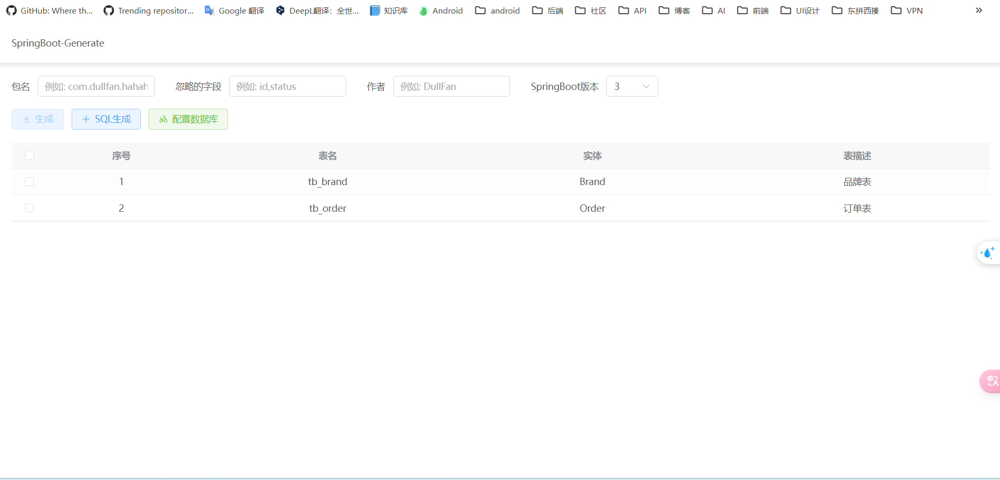

## 简介

SpringBoot-Generate是一款代码生成工具，旨在通过根据SQL语句生成代码或连接本地数据库来简化开发过程。该项目通过自动生成代码，
减少了重复编码的工作，使开发者能够专注于项目的复杂部分。这款工具可以快速生成模板代码，确保开发流程的一致性和高效性。生成器支持多种数据库连接，
并提供用户友好的界面，便于与现有项目无缝集成。

## 功能
- [x] 使用Velocity模板替换手动字符串拼接方式
- [x] 配置动态数据源,支持动态的添加数据源和切换数据源,不需要重启服务
- [x] 生成代码支持浏览器下载以及生成到对应路径
- [x] 根据主键生成查询、修改、删除
- [ ] 联表查询
- [ ] 树形数据

## 可选导入依赖
```xml
<dependency>
    <groupId>org.projectlombok</groupId>
    <artifactId>lombok</artifactId>
    <scope>provided</scope>
</dependency>
```

## UI

前端文件在ui中,用Vue3 + Vite + ElementPlus写的

## API

### 生成数据库中所有表代码
* POST /api/generateCodeAll
* 请求数据类型: application/json
* 请求参数

| 参数名称          | 参数说明          | 参数类型 |
|------------------|---------------|---------|
| tablePrefix      | 是否使用表前缀       | boolean |
| enabledLombok    | 是否使用Lombok    | boolean |
| packageBase      | 基础包名          | String  |
| fieldIgnoreList  | 要忽略的字段列表      | String  |
| author           | 作者            | String  |
| sqlIp            | 数据库IP地址       | String  |
| ipPort           | 数据库端口号        | String  |
| sqlName          | 数据库名称         | String  |
| sqlUsername      | 数据库用户名        | String  |
| sqlPassword      | 数据库密码         | String  |
| springBootVersion| Spring Boot版本 | String  |
* 请求示例
```json
{
  "tablePrefix":"true",
  "enabledLombok":"true",
  "packageBase":"com.hahaha",
  "fieldIgnoreList":"id,status",
  "author":"DullFan",
  "sqlIp":"127.0.0.1",
  "ipPort":"3306",
  "sqlName":"community",
  "sqlUsername":"root",
  "sqlPassword":"Fan292852.",
  "springBootVersion":"3"
}
```

### 生成对应表代码
* POST /api/generateCodeByTableName
* 请求数据类型: application/json
* 请求参数(其他参数如上)

| 参数名称          | 参数说明         | 参数类型    |
|------------------|--------------|---------|
| databaseName     | 数据库名（逗号分割）| String  |
* 请求示例
```json
{
  "tablePrefix":"true",
  "enabledLombok":"true",
  "packageBase":"com.dullfan.hahaha",
  "fieldIgnoreList":"id,status",
  "author":"DullFan",
  "sqlIp":"localhost",
  "ipPort":"3306",
  "sqlName":"community",
  "sqlUsername":"root",
  "sqlPassword":"Fan292852.",
  "springBootVersion":"3",
  "databaseName":"articles,articles_tag"
}
```

### 根据SQL生成代码
* POST /api/generateCodeBySQL
* 请求数据类型: application/json
* 请求参数(其他参数如上)

| 参数名称          | 参数说明           | 参数类型 |
|------------------|-------------------|---------|
| sqlStatement     | SQL语句（分号分割）            | String  |
* 请求示例
```json
{
  "sqlStatement": "CREATE TABLE `articles_tag` (\n  `id` bigint unsigned NOT NULL AUTO_INCREMENT COMMENT '主键',\n  `name` varchar(30) DEFAULT NULL COMMENT '标签名称',\n  `description` varchar(100) DEFAULT NULL COMMENT '标签描述',\n  `status` int unsigned DEFAULT '1' COMMENT '状态，1是可用，2是不可用',\n  `create_by` int unsigned DEFAULT '0' COMMENT '创建者ID',\n  `create_time` datetime DEFAULT CURRENT_TIMESTAMP COMMENT '创建时间',\n  PRIMARY KEY (`id`)\n) ENGINE=InnoDB AUTO_INCREMENT=6 DEFAULT CHARSET=utf8mb3 COMMENT='文章标签表';\n\nCREATE TABLE `articles` (\n  `id` bigint unsigned NOT NULL AUTO_INCREMENT COMMENT '主键',\n  `content` longblob COMMENT '内容',\n  `author_id` int unsigned DEFAULT '0' COMMENT '作者ID',\n  `publish_time` datetime DEFAULT CURRENT_TIMESTAMP COMMENT '发布时间',\n  `is_top` tinyint unsigned DEFAULT '0' COMMENT '是否置顶，0：不置顶，1：置顶',\n  `reviewer_id` int unsigned DEFAULT '0' COMMENT '审核人员ID',\n  `reviewer_time` datetime DEFAULT CURRENT_TIMESTAMP COMMENT '审核时间',\n  `status` int unsigned DEFAULT '1' COMMENT '状态，0是正常状态，1是审核状态，2是封禁状态',\n  `tag_id` int unsigned DEFAULT '1' COMMENT '文章标签',\n  `browse_count` int unsigned DEFAULT '0' COMMENT '浏览量',\n  `comment_count` int unsigned DEFAULT '0' COMMENT '评论数',\n  `thumbs_up_count` int unsigned DEFAULT '0' COMMENT '点赞数',\n  PRIMARY KEY (`id`)\n) ENGINE=InnoDB AUTO_INCREMENT=24 DEFAULT CHARSET=utf8mb3 COMMENT='文章表';",
  "packageBase": "com.hahaha",
  "author": "DullFan",
  "springBootVersion": 3,
  "tablePrefix": true,
  "enabledLombok":"true"
}
```

### 将代码生成到指定路径中(需本地使用)
* POST /api/exportLocalCode
* 请求数据类型: application/json
* 请求参数(其他参数如上)

| 参数名称          | 参数说明 | 参数类型 |
|------------------|------|---------|
| exportLocal     | 输出路径 | String  |
* 请求示例
```json
{
  "packageBase": "com.hahaha",
  "author": "DullFan",
  "springBootVersion": 3,
  "tablePrefix": false,
  "enabledLombok":"true",
  "exportLocal":"D:/AResourceData/testResources/aaaa"
}
```
* 返回结果
```json
{
  "msg": "操作成功",
  "code": 200
}
```

### 获取当前数据库中所有表（连接数据库后可用）
* POST /api/findAllSQLStructure
* 请求数据类型: application/json
* 请求参数(其他参数如上)
* 请求示例
```json
{
    "tablePrefix":"true",
    "packageBase":"com.dullfan.hahaha",
    "fieldIgnoreList":"id,status",
    "author":"DullFan",
    "sqlIp":"localhost",
    "ipPort":"3306",
    "sqlName":"my_batis",
    "sqlUsername":"root",
    "sqlPassword":"Fan292852.",
    "springBootVersion":"3"
}
```
* 返回结果 
```json
{
	"msg": "操作成功",
	"code": 200,
	"data": [
		{
			"tableName": "tb_brand",
			"beanName": "Brand",
			"beanParamName": "brandtrue",
			"comment": "品牌表",
			"fieldInfoList": null,
			"keyIndexMap": {},
			"haveDate": false,
			"haveDateTime": false,
			"haveBigDecimal": false,
			"haveJsonIgnore": false,
			"extendFieldInfoList": null
		},
		{
			"tableName": "tb_order",
			"beanName": "Order",
			"beanParamName": "ordertrue",
			"comment": "订单表",
			"fieldInfoList": null,
			"keyIndexMap": {},
			"haveDate": false,
			"haveDateTime": false,
			"haveBigDecimal": false,
			"haveJsonIgnore": false,
			"extendFieldInfoList": null
		}
	]
}
```


## 关键文件介绍

测试SQL
```mysql
CREATE TABLE `articles` (
     `id` bigint unsigned NOT NULL AUTO_INCREMENT COMMENT '主键',
     `content` longblob COMMENT '内容',
     `author_id` int unsigned DEFAULT '0' COMMENT '作者ID',
     `publish_time` datetime DEFAULT CURRENT_TIMESTAMP COMMENT '发布时间',
     `is_top` tinyint unsigned DEFAULT '0' COMMENT '是否置顶，0：不置顶，1：置顶',
     `reviewer_id` int unsigned DEFAULT '0' COMMENT '审核人员ID',
     `reviewer_time` datetime DEFAULT CURRENT_TIMESTAMP COMMENT '审核时间',
     `status` int unsigned DEFAULT '1' COMMENT '状态，0是正常状态，1是审核状态，2是封禁状态',
     `tag_id` int unsigned DEFAULT '1' COMMENT '文章标签',
     `browse_count` int unsigned DEFAULT '0' COMMENT '浏览量',
     `comment_count` int unsigned DEFAULT '0' COMMENT '评论数',
     `thumbs_up_count` int unsigned DEFAULT '0' COMMENT '点赞数',
     PRIMARY KEY (`id`)
) ENGINE=InnoDB AUTO_INCREMENT=24 DEFAULT CHARSET=utf8mb3 COMMENT='文章表';
```
根据工具生成的Controller代码
```java
@RestController("ArticlesController")
@RequestMapping("/articles")
public class ArticlesController extends ABaseController  {

    @Resource
    ArticlesService articlesService;

    /**
     * 分页查询
     */
    @GetMapping("/loadDataList")
    public Result selectListByPage(ArticlesQuery param){
        return success(articlesService.selectListByPage(param));
    }

    /**
     * 新增
     */
    @PostMapping("/insert")
    public Result insert(@RequestBody Articles bean){
        Integer result = articlesService.insert(bean);
        return determineOperationOutcome(result);
    }

    /**
     * 批量新增
     */
    @PostMapping("/insertBatch")
    public Result insertBatch(@RequestBody List<Articles> listBean){
        Integer result = articlesService.insertBatch(listBean);
        return determineOperationOutcome(result);
    }

    /**
     * 根据 Id 查询
     */
    @GetMapping("/selectById")
    public Result selectById(@RequestParam Long id){
        return success(articlesService.selectById(id));
    }

    /**
     * 根据 Id 修改
     */
    @PutMapping("/updateById")
    public Result updateById(@RequestBody Articles bean,@RequestParam Long id){
        Integer result = articlesService.updateById(bean,id);
        return determineOperationOutcome(result);
    }


    /**
     * 根据 Id 删除
     */
    @DeleteMapping("/deleteById")
    public Result deleteById(@RequestParam Long id){
        Integer result = articlesService.deleteById(id);
        return determineOperationOutcome(result);
    }
    /**
     * 根据 Id 批量删除
     */
    @DeleteMapping("/deleteByIdBatch")
    public Result deleteByIdBatch(@RequestParam List<Integer> list){
        Integer result = articlesService.deleteByIdBatch(list);
        return determineOperationOutcome(result);
    }
}
```
BrandQuery
```java
/**
 * @author DullFan
 * @date 2024-07-10 21:02:25
 */
public class ArticlesQuery extends ABaseParam {


    /**
     * 主键
     */
    private Long id;

    /**
     * 内容
     */
    private String content;

    /**
     * 作者ID
     */
    private Integer authorId;

    /**
     * 发布时间
     */
    @JsonFormat(pattern = "yyyy-MM-dd HH:mm:ss", timezone = "GMT+8")
    @DateTimeFormat(pattern = "yyyy-MM-dd HH:mm:ss")
    private Date publishTime;

    /**
     * 是否置顶，0：不置顶，1：置顶
     */
    private Integer isTop;

    /**
     * 审核人员ID
     */
    private Integer reviewerId;

    /**
     * 审核时间
     */
    @JsonFormat(pattern = "yyyy-MM-dd HH:mm:ss", timezone = "GMT+8")
    @DateTimeFormat(pattern = "yyyy-MM-dd HH:mm:ss")
    private Date reviewerTime;

    /**
     * 状态，0是正常状态，1是审核状态，2是封禁状态
     */
    private Integer status;

    /**
     * 文章标签
     */
    private Integer tagId;

    /**
     * 浏览量
     */
    private Integer browseCount;

    /**
     * 评论数
     */
    private Integer commentCount;

    /**
     * 点赞数
     */
    private Integer thumbsUpCount;


    private String contentfuzzy;

    @JsonFormat(pattern = "yyyy-MM-dd HH:mm:ss", timezone = "GMT+8")
    @DateTimeFormat(pattern = "yyyy-MM-dd HH:mm:ss")
    private Date publishTimeStart;

    @JsonFormat(pattern = "yyyy-MM-dd HH:mm:ss", timezone = "GMT+8")
    @DateTimeFormat(pattern = "yyyy-MM-dd HH:mm:ss")
    private Date publishTimeEnd;

    @JsonFormat(pattern = "yyyy-MM-dd HH:mm:ss", timezone = "GMT+8")
    @DateTimeFormat(pattern = "yyyy-MM-dd HH:mm:ss")
    private Date reviewerTimeStart;

    @JsonFormat(pattern = "yyyy-MM-dd HH:mm:ss", timezone = "GMT+8")
    @DateTimeFormat(pattern = "yyyy-MM-dd HH:mm:ss")
    private Date reviewerTimeEnd;
}
```
## 联系我

* QQ：2928527233
* CSDN：https://blog.csdn.net/weixin_51298509

