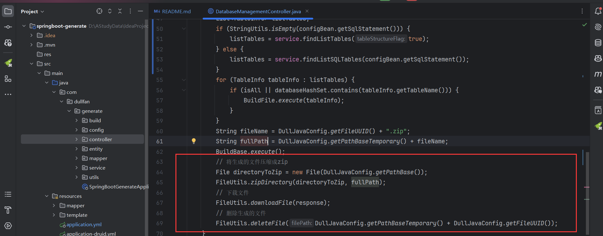
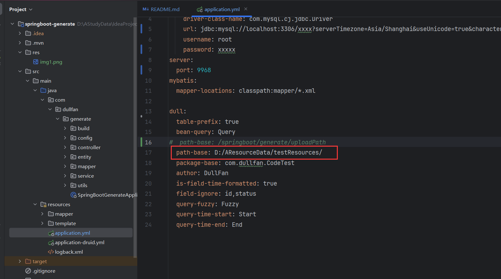

## 简介

SpringBoot-Generate是一款代码生成工具，旨在通过根据SQL语句生成代码或连接本地数据库来简化开发过程。该项目通过自动生成代码，
减少了重复编码的工作，使开发者能够专注于项目的复杂部分。这款工具可以快速生成模板代码，确保开发流程的一致性和高效性。生成器支持多种数据库连接，
并提供用户友好的界面，便于与现有项目无缝集成。

## 功能

1. 底层框架使用的是SpringBoot.
2. ORM框架选择的是MyBatis + 通用Mapper.
3. 配置动态数据源,支持动态的添加数据源和切换数据源,不需要重启服务.
4. 代码生成的时候支持浏览器下载和生成到本地.

## UI

前端文件在ui中,用Vue3 + Vite + ElementPlus写的

## API

### 生成数据库中所有表代码
* POST /api/findAllSQLResource
* 请求数据类型: application/json
* 请求参数

| 参数名称          | 参数说明           | 参数类型 |
|------------------|-------------------|---------|
| tablePrefix      | 是否使用表前缀      | boolean |
| packageBase      | 基础包名           | String  |
| fieldIgnoreList  | 要忽略的字段列表    | String  |
| author           | 作者               | String  |
| sqlIp            | 数据库IP地址        | String  |
| ipPort           | 数据库端口号        | String  |
| sqlName          | 数据库名称          | String  |
| sqlUsername      | 数据库用户名        | String  |
| sqlPassword      | 数据库密码          | String  |
| springBootVersion| Spring Boot版本    | String  |
* 请求示例
```json
{
    "tablePrefix":"true",
    "packageBase":"com.dullfan.hahaha",
    "fieldIgnoreList":"id,status",
    "author":"DullFan",
    "sqlIp":"localhost",
    "ipPort":"3306",
    "sqlName":"my_batis",
    "sqlUsername":"root",
    "sqlPassword":"Fan292852.",
    "springBootVersion":"3"
}
```

### 生成对应表代码
* POST /api/findSQLResource
* 请求数据类型: application/json
* 请求参数

| 参数名称          | 参数说明         | 参数类型    |
|------------------|--------------|---------|
| tablePrefix      | 是否使用表前缀      | boolean |
| packageBase      | 基础包名         | String  |
| fieldIgnoreList  | 要忽略的字段列表     | String  |
| author           | 作者           | String  |
| sqlIp            | 数据库IP地址      | String  |
| ipPort           | 数据库端口号       | String  |
| sqlName          | 数据库名称        | String  |
| sqlUsername      | 数据库用户名       | String  |
| sqlPassword      | 数据库密码        | String  |
| springBootVersion| Spring Boot版本 | String  |
| databaseName     | 数据库名（逗号分割）| String  |
* 请求示例
```json
{
    "tablePrefix":"true",
    "packageBase":"com.dullfan.hahaha",
    "fieldIgnoreList":"id,status",
    "author":"DullFan",
    "sqlIp":"localhost",
    "ipPort":"3306",
    "sqlName":"my_batis",
    "sqlUsername":"root",
    "sqlPassword":"Fan292852.",
    "springBootVersion":"3",
    "databaseName":"tb_order,tb_brand"
}
```

### 根据SQL生成代码
* POST /api/findAllSQLResource
* 请求数据类型: application/json
* 请求参数

| 参数名称          | 参数说明           | 参数类型 |
|------------------|-------------------|---------|
| tablePrefix      | 是否使用表前缀      | boolean |
| packageBase      | 基础包名           | String  |
| fieldIgnoreList  | 要忽略的字段列表    | String  |
| author           | 作者               | String  |
| springBootVersion| Spring Boot版本    | String  |
| sqlStatement     | SQL语句            | String  |
* 请求示例
```json
{
    "tablePrefix": "true",
    "packageBase": "com.dullfan.hahaha",
    "fieldIgnoreList": "id,status",
    "author": "DullFan",
    "springBootVersion": "3",
    "sqlStatement": "CREATE TABLE `articles` ( `id` bigint unsigned NOT NULL AUTO_INCREMENT COMMENT '主键', `content` longblob COMMENT '内容', `author_id` int unsigned DEFAULT '0' COMMENT '作者ID', `publish_time` datetime DEFAULT CURRENT_TIMESTAMP COMMENT '发布时间', `is_top` tinyint unsigned DEFAULT '0' COMMENT '是否置顶，0：不置顶，1：置顶', `reviewer_id` int unsigned DEFAULT '0' COMMENT '审核人员ID', `reviewer_time` datetime DEFAULT CURRENT_TIMESTAMP COMMENT '审核时间', `status` int unsigned DEFAULT '1' COMMENT '状态，0是正常状态，1是审核状态，2是封禁状态', `tag_id` int unsigned DEFAULT '1' COMMENT '文章标签', `browse_count` int unsigned DEFAULT '0' COMMENT '浏览量', `comment_count` int unsigned DEFAULT '0' COMMENT '评论数', `thumbs_up_count` int unsigned DEFAULT '0' COMMENT '点赞数', PRIMARY KEY (`id`)) ENGINE=InnoDB AUTO_INCREMENT=17 DEFAULT CHARSET=utf8mb3 COMMENT='文章表'; CREATE TABLE `comment` ( `id` bigint unsigned NOT NULL AUTO_INCREMENT COMMENT '主键', `content` varchar(200) DEFAULT NULL COMMENT '内容', `comment_user_id` int unsigned DEFAULT '0' COMMENT '评论者ID', `comment_articles_id` int unsigned DEFAULT '0' COMMENT '评论所属文章ID', `reply_count` int unsigned DEFAULT '0' COMMENT '回复量', `comment_thumbs_up_count` int unsigned DEFAULT '0' COMMENT '点赞量', `comment_time` datetime DEFAULT CURRENT_TIMESTAMP COMMENT '评论时间', PRIMARY KEY (`id`)) ENGINE=InnoDB AUTO_INCREMENT=4 DEFAULT CHARSET=utf8mb3 COMMENT='文章评论表';"
}

```

### 获取当前数据库中所有表（连接数据库后可用）
* POST /api/findAllSQLStructure
* 请求数据类型: application/json
* 请求参数

| 参数名称          | 参数说明           | 参数类型 |
|------------------|-------------------|---------|
| tablePrefix      | 是否使用表前缀      | boolean |
| packageBase      | 基础包名           | String  |
| fieldIgnoreList  | 要忽略的字段列表    | String  |
| author           | 作者               | String  |
| sqlIp            | 数据库IP地址        | String  |
| ipPort           | 数据库端口号        | String  |
| sqlName          | 数据库名称          | String  |
| sqlUsername      | 数据库用户名        | String  |
| sqlPassword      | 数据库密码          | String  |
| springBootVersion| Spring Boot版本    | String  |
* 请求示例
```json
{
    "tablePrefix":"true",
    "packageBase":"com.dullfan.hahaha",
    "fieldIgnoreList":"id,status",
    "author":"DullFan",
    "sqlIp":"localhost",
    "ipPort":"3306",
    "sqlName":"my_batis",
    "sqlUsername":"root",
    "sqlPassword":"Fan292852.",
    "springBootVersion":"3"
}
```
* 返回结果 
```json
{
	"msg": "操作成功",
	"code": 200,
	"data": [
		{
			"tableName": "tb_brand",
			"beanName": "Brand",
			"beanParamName": "brandtrue",
			"comment": "品牌表",
			"fieldInfoList": null,
			"keyIndexMap": {},
			"haveDate": false,
			"haveDateTime": false,
			"haveBigDecimal": false,
			"haveJsonIgnore": false,
			"extendFieldInfoList": null
		},
		{
			"tableName": "tb_order",
			"beanName": "Order",
			"beanParamName": "ordertrue",
			"comment": "订单表",
			"fieldInfoList": null,
			"keyIndexMap": {},
			"haveDate": false,
			"haveDateTime": false,
			"haveBigDecimal": false,
			"haveJsonIgnore": false,
			"extendFieldInfoList": null
		}
	]
}
```


## 生成文件介绍

如果要保存文件就将这里的代码注释

修改上方自定义保存路径

测试SQL
```mysql
CREATE TABLE `tb_brand` (
  `id` int NOT NULL AUTO_INCREMENT COMMENT '主键',
  `brand_name` varchar(20) CHARACTER SET utf8mb4 COLLATE utf8mb4_0900_ai_ci DEFAULT NULL COMMENT '品牌名称',
  `company_name` varchar(20) CHARACTER SET utf8mb4 COLLATE utf8mb4_0900_ai_ci DEFAULT NULL COMMENT '公司名称',
  `ordered` int DEFAULT NULL COMMENT '价格',
  `description` varchar(100) CHARACTER SET utf8mb4 COLLATE utf8mb4_0900_ai_ci DEFAULT NULL COMMENT '描述',
  `status` int DEFAULT NULL COMMENT '状态',
  `create_time` datetime DEFAULT NULL COMMENT '创建时间',
  `update_time` date DEFAULT NULL COMMENT '更新时间',
  `create_money` float DEFAULT NULL COMMENT '公司注册金额',
  PRIMARY KEY (`id`),
  UNIQUE KEY `idx_unique` (`brand_name`) USING BTREE,
  UNIQUE KEY `idx_create_money_and_company_name` (`company_name`,`create_money`) USING BTREE,
  KEY `idx_test` (`status`) USING BTREE,
  FULLTEXT KEY `idx_test2` (`description`)
) ENGINE=InnoDB AUTO_INCREMENT=22 DEFAULT CHARSET=utf8mb4 COLLATE=utf8mb4_0900_ai_ci COMMENT='品牌表';
```
根据工具生成的Controller代码
```java
@RestController("TbBrandController")
@RequestMapping("/tbBrand")
public class TbBrandController extends ABaseController {
	@Resource
	private TbBrandService tbBrandService;
	/**
	 * 根据条件分页查询
	 */
	@GetMapping("/loadDataList")
	public AjaxResult loadDataList(TbBrandQuery param){
		return getSuccessAjaxResult(tbBrandService.findListByPage(param));
	}
	/**
	 * 新增
	 */
	@PostMapping("/add")
	public AjaxResult add(@RequestBody TbBrand bean) {
		tbBrandService.add(bean);
		return getSuccessAjaxResult(null);
	}
	/**
	 * 批量新增
	 */
	@PostMapping("/addBatch")
	public AjaxResult addBatch(@RequestBody List<TbBrand> listBean) {
		tbBrandService.addBatch(listBean);
		return getSuccessAjaxResult(null);
	}
	/**
	 * 批量新增/修改
	 */
	@PostMapping("/addOrUpdateBatch")
	public AjaxResult addOrUpdateBatch(@RequestBody List<TbBrand> listBean) {
		tbBrandService.addBatch(listBean);
		return getSuccessAjaxResult(null);
	}
	/**
	 * 根据Id查询对象
	 */
	@GetMapping("/getTbBrandById")
	public AjaxResult getTbBrandById(Integer id) {
		return getSuccessAjaxResult(tbBrandService.getTbBrandById(id));
	}
	/**
	 * 根据Id修改对象
	 */
	@PutMapping("/updateTbBrandById")
	public AjaxResult updateTbBrandById(TbBrand bean,Integer id) {
		tbBrandService.updateTbBrandById(bean,id);
		return getSuccessAjaxResult(null);
	}
	/**
	 * 根据Id删除
	 */
	@DeleteMapping("/deleteTbBrandById")
	public AjaxResult deleteTbBrandById(Integer id) {
		tbBrandService.deleteTbBrandById(id);
		return getSuccessAjaxResult(null);
	}
	/**
	 * 根据Id批量删除
	 */
	@DeleteMapping("/deleteTbBrandByIdBatch")
	public AjaxResult deleteTbBrandByIdBatch(@RequestParam List<Integer> list) {
		tbBrandService.deleteTbBrandByIdBatch(list);
		return getSuccessAjaxResult(null);
	}
	/**
	 * 根据BrandName查询对象
	 */
	@GetMapping("/getTbBrandByBrandName")
	public AjaxResult getTbBrandByBrandName(String brandName) {
		return getSuccessAjaxResult(tbBrandService.getTbBrandByBrandName(brandName));
	}
	/**
	 * 根据BrandName修改对象
	 */
	@PutMapping("/updateTbBrandByBrandName")
	public AjaxResult updateTbBrandByBrandName(TbBrand bean,String brandName) {
		tbBrandService.updateTbBrandByBrandName(bean,brandName);
		return getSuccessAjaxResult(null);
	}
	/**
	 * 根据BrandName删除
	 */
	@DeleteMapping("/deleteTbBrandByBrandName")
	public AjaxResult deleteTbBrandByBrandName(String brandName) {
		tbBrandService.deleteTbBrandByBrandName(brandName);
		return getSuccessAjaxResult(null);
	}
	/**
        * 唯一索引
	 * 根据CompanyNameAndCreateMoney查询对象
	 */
	@GetMapping("/getTbBrandByCompanyNameAndCreateMoney")
	public AjaxResult getTbBrandByCompanyNameAndCreateMoney(String companyName,BigDecimal createMoney) {
		return getSuccessAjaxResult(tbBrandService.getTbBrandByCompanyNameAndCreateMoney(companyName,createMoney));
	}
	/**
	 * 根据CompanyNameAndCreateMoney修改对象
	 */
	@PutMapping("/updateTbBrandByCompanyNameAndCreateMoney")
	public AjaxResult updateTbBrandByCompanyNameAndCreateMoney(TbBrand bean,String companyName,BigDecimal createMoney) {
		tbBrandService.updateTbBrandByCompanyNameAndCreateMoney(bean,companyName,createMoney);
		return getSuccessAjaxResult(null);
	}
	/**
	 * 根据CompanyNameAndCreateMoney删除
	 */
	@DeleteMapping("/deleteTbBrandByCompanyNameAndCreateMoney")
	public AjaxResult deleteTbBrandByCompanyNameAndCreateMoney(String companyName,BigDecimal createMoney) {
		tbBrandService.deleteTbBrandByCompanyNameAndCreateMoney(companyName,createMoney);
		return getSuccessAjaxResult(null);
	}
}
```
BrandQuery
```java
public class BrandQuery extends BaseParam {
	/**
	 * 主键
	 */
	private Integer id;
	/**
	 * 品牌名称
	 */
	private String brandName;
        /**
         * 有Fuzzy的就是模糊搜索
         */ 
	private String brandNameFuzzy;
	/**
	 * 公司名称
	 */
	private String companyName;
	private String companyNameFuzzy;
	/**
	 * 价格
	 */
	private Integer ordered;
	/**
	 * 描述
	 */
	private String description;
	private String descriptionFuzzy;
	/**
	 * 状态
	 */
	private Integer status;
	/**
	 * 创建时间
	 */
	private String createTime;
        /**
         * 创建时间开始时间
         */
	private String createTimeStart;
        /**
         * 创建时间结束时间
         */
	private String createTimeEnd;
	/**
	 * 更新时间
	 */
	private String updateTime;
	private String updateTimeStart;
	private String updateTimeEnd;
}
```
## 联系我

* QQ：2928527233
* CSDN：https://blog.csdn.net/weixin_51298509

